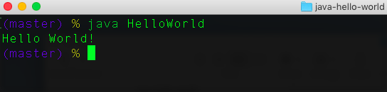

# Java Hello World

This is my first program in Java.
- See [Writing Your First Java Program, Hello World](java/java-hello-world.md) for step-by-step instructions.
- This program runs in the console.
- The [Hello World]( http://tpcg.io/No64y7) app is live, run it [here]( http://tpcg.io/No64y7)


## DEPENDENCIES

- Java v8, Update 161

## Install and Run

- Clone repo
- On Mac, open terminal and change to the java-hello-world directory
- Run HelloWorld.class

```java
    java HelloWorld
```
<p align="center">
  
</p>

## REFERENCES

- [Installing Java](https://java.com/en/download/help/index_installing.xml)
- [Oracle Java Docs](https://java.com/en/download/faq/java_mac.xml) 
- [Oracle: A Closer Look at the "Hello World!" Application](https://docs.oracle.com/javase/tutorial/getStarted/application/index.html)
